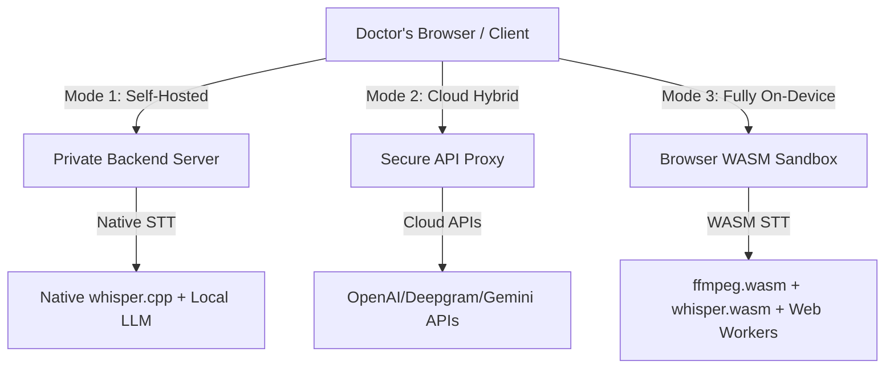

# Clinical Scribe

## Overview

Clinical Scribe is an ambient audio assistant for in-person (and over-video) doctor-patient consultations. It listens to a visit, transcribes it privately on a self-hosted backend, and uses an LLM to generate a structured SOAP note and a draft prescription. The doctor reviews and edits this output after the session in a secure "Inbox," alongside the patient's profile and history, before it's copied into the hospital's EHR system and the prescription is routed to the pharmacy for delivery or pickup.

All transcription and LLM inference is processed locally and privately on a self-hosted backend. No audio or text data leaves the self-hosted infrastructure, and no third-party cloud APIs (such as OpenAI or Google Cloud Speech-to-Text) are used. The frontend records audio chunks and streams them directly to your own self-hosted server process via secure HTTP. This deliberate design preserves a strong privacy and compliance story, suitable for secure LAN/VPC deployment, while allowing the backend to handle resource-intensive native whisper.cpp transcription (enabling GPU acceleration and high performance) without blocking or slowing down the client browser.

Next Phase: video calling and remote scheduling of X-rays/MRIs/diagnostics, agentic suggestions to doctor regarding session flow and prescription.


## Architectural Vision: Pluggable Processing Engines

To accommodate different deployment scales, compliance requirements, and client-side hardware constraints, Clinical Scribe is designed with a **pluggable processing architecture** in mind. The system will support three processing modes:



1. **Self-Hosted Private Backend (Default / Current Focus)**
   * **How it works:** Audio is captured by the client and streamed in chunks to a private server (e.g., in a hospital LAN or secure VPC). The backend processes audio using native `ffmpeg` and `whisper.cpp` (allowing GPU acceleration) and queries local LLM endpoints.
   * **Best for:** Medium-to-large healthcare organizations requiring total data ownership without high client-side CPU/memory overhead.

2. **Cloud Hybrid (Optional Adapter)**
   * **How it works:** Audio is sent to the backend, which proxies transcription and inference to commercial HIPAA-compliant cloud services (e.g., OpenAI, Deepgram, Azure, Gemini API) under Business Associate Agreements (BAAs).
   * **Best for:** Independent practitioners or small clinics looking for high-accuracy native transcription with minimal self-hosting infrastructure overhead.

3. **Fully On-Device (Stretch WASM Goal)**
   * **How it works:** Audio recording, resampling (`ffmpeg.wasm`), speech-to-text (`whisper.cpp` via WASM), and LLM generation (using client-side models) occur entirely inside the browser sandboxed environment. No raw audio ever leaves the physical client machine.
   * **Best for:** Individual doctors seeking ultimate zero-trust privacy with zero local server infrastructure dependencies.


## System Prerequisites

To run the backend application, you must have **ffmpeg** installed on your system. It is used to resample recorded audio chunks to 16kHz mono WAV format suitable for speech-to-text models:

* **macOS:** `brew install ffmpeg`
* **Ubuntu/Debian:** `sudo apt update && sudo apt install -y ffmpeg`
* **Docker:** Ensure `ffmpeg` is installed in your Docker container (e.g., `apk add ffmpeg` or `apt-get install -y ffmpeg`).

A validation check runs at backend server startup and will warn you if `ffmpeg` is missing from your system `PATH`.


## Repository Structure & Workspaces

This project is organized as a monorepo utilizing **Bun Workspaces**:

```text
clinical-scribe/
├── .github/
│   └── workflows/
│       └── typescript.yml # CI workflow for linting, typechecking, and testing
├── package.json          # Root package.json defining workspaces
├── bun.lock              # Single, unified lockfile for the whole project
├── apps/
│   ├── backend/          # Hono + Drizzle SQLite API
│   │   ├── src/          # Backend source files
│   │   ├── package.json
│   │   └── drizzle.config.ts
│   └── frontend/         # React + Vite + TypeScript web application
│       ├── src/          # Frontend React components and styles
│       ├── package.json
│       └── vite.config.ts
```

### Workspace Commands

All developer commands can be run directly from the root of the project using Bun:

* **Install all dependencies:**
  ```bash
  bun install
  ```
* **Run Hono API Dev Server (Backend):**
  ```bash
  bun run dev:backend
  ```
* **Run React/Vite Dev Server (Frontend):**
  ```bash
  bun run dev:frontend
  ```
* **Run Monorepo Typechecking:**
  ```bash
  bun run typecheck
  ```
* **Run Frontend Linter:**
  ```bash
  bun run lint
  ```
* **Run Backend Test Suite:**
  ```bash
  bun run test
  ```
* **Database migrations & seeding (Drizzle Kit):**
  ```bash
  bun run db:generate    # Scans schemas and generates SQL migrations
  bun run db:migrate     # Applies migrations to the local SQLite database
  bun run db:seed        # Seeds the database with sample data
  ```

### Environment Variables

The backend can be configured using a `.env` file inside `apps/backend/`. A template is provided in `apps/backend/.env.example`.

* **`PORT`** (Default: `3000`): The port the Hono backend server listens on.
* **`DATABASE_PATH`** (Default: `./data/clinical-scribe.sqlite`): File path to the SQLite database.
* **`UPLOAD_DIR`** (Default: `/tmp`): The folder where uploaded audio files are saved (pruned every 3 days by macOS if left to default).

### Docker Deployment

A `Dockerfile` is provided at the root of the project to package the application with all necessary system dependencies pre-configured.

1. **Build the image:**
   ```bash
   docker build -t clinical-scribe .
   ```

2. **Run the container:**
   ```bash
   docker run -p 3000:3000 clinical-scribe
   ```

The container automatically installs `ffmpeg` and starts the Hono backend server.


---

## Project Goals

1. **Reliable local transcription.** Get whisper.cpp producing accurate, medically-literate transcripts from saved audio, one session at a time, without relying on any external API.
2. **Useful structured output.** Turn a raw transcript into a SOAP note and draft prescription that a doctor would actually trust enough to lightly edit rather than rewrite from scratch.
3. **A review workflow that fits how doctors actually work.** The Inbox should make it fast to confirm, edit, and push notes to the EHR and pharmacy — not add a new chore on top of the visit.
4. **Defensible privacy and compliance posture.** A self-hosted, private backend architecture is the foundation (ensuring no data is ever transmitted to third-party cloud APIs), but the surrounding system (access control, audit trail, retention policy) needs to actually hold up if this were ever used with real patients.
5. **(Stretch) Pattern-aware suggestions.** Surface relevant context from a doctor's own past diagnoses/notes when it's genuinely useful — not a vague "AI finds patterns" promise, but a scoped, specific feature (see below).

---

## Current State

The backend API is built using [Hono](https://hono.dev/) and is organized into six routers: Patients, Doctors, Sessions, SOAP Notes, Transcripts, and Uploads. Routes, schema, and tests for all six are done.

### Patients (`/api/patients`)
Defined in [apps/backend/src/routes/patients.ts](file:///Users/arnavkohli/src/personal-projects/clinical-scribe/apps/backend/src/routes/patients.ts).

| Method | Path | Description |
| :--- | :--- | :--- |
| **GET** | `/` | Retrieves a list of all patients. |
| **GET** | `/:id` | Retrieves a single patient's details by their ID. |
| **POST** | `/` | Creates a new patient. <br> **Request Body**: `{ name: string, email: string, password?: string, mrn?: string, dateOfBirth?: string }` (name and email are required). |
| **PATCH** | `/:id` | Updates a patient's details by ID. <br> **Request Body**: `{ name?: string, email?: string, password?: string, mrn?: string, dateOfBirth?: string }`. |
| **DELETE** | `/:id` | Deletes a patient by their ID. |

### Doctors (`/api/doctors`)
Defined in [apps/backend/src/routes/doctors.ts](file:///Users/arnavkohli/src/personal-projects/clinical-scribe/apps/backend/src/routes/doctors.ts).

| Method | Path | Description |
| :--- | :--- | :--- |
| **GET** | `/` | Retrieves a list of all doctors. |
| **GET** | `/:id` | Retrieves a single doctor's details by their ID. |
| **POST** | `/` | Creates a new doctor. <br> **Request Body**: `{ name: string, email: string, password?: string }` (name and email are required). |
| **PATCH** | `/:id` | Updates a doctor's details by ID. <br> **Request Body**: `{ name?: string, email?: string, password?: string }`. |
| **DELETE** | `/:id` | Deletes a doctor by their ID. |

### Sessions (`/api/sessions`)
Defined in [apps/backend/src/routes/sessions.ts](file:///Users/arnavkohli/src/personal-projects/clinical-scribe/apps/backend/src/routes/sessions.ts).

| Method | Path | Description |
| :--- | :--- | :--- |
| **GET** | `/` | Retrieves a list of all sessions. |
| **GET** | `/:id` | Retrieves a single session's details by its ID. |
| **POST** | `/` | Creates a new consultation session. <br> **Request Body**: `{ patientId: string, doctorId: string, status?: string, audioPath?: string }` (patientId and doctorId are required; status defaults to `"recording"`). |
| **PATCH** | `/:id` | Updates a session's metadata or status. <br> **Request Body**: `{ status?: "recording" \| "processing" \| "transcribed" \| "reviewed", audioPath?: string, endedAt?: string }`. |
| **DELETE** | `/:id` | Deletes a session by its ID. |

### SOAP Notes (`/api/notes`)
Defined in [apps/backend/src/routes/notes.ts](file:///Users/arnavkohli/src/personal-projects/clinical-scribe/apps/backend/src/routes/notes.ts).

| Method | Path | Description |
| :--- | :--- | :--- |
| **GET** | `/` | Retrieves a list of all SOAP notes. |
| **GET** | `/:id` | Retrieves a single SOAP note by its ID. |
| **GET** | `/session/:sessionId` | Retrieves all SOAP notes associated with a specific session ID. |
| **POST** | `/` | Creates a SOAP note for a session. <br> **Request Body**: `{ sessionId: string, subjective?: string, objective?: string, assessment?: string, plan?: string, doctorEdited?: boolean }` (sessionId is required). |
| **PATCH** | `/:id` | Updates an existing SOAP note by its ID. <br> **Request Body**: `{ subjective?: string, objective?: string, assessment?: string, plan?: string, doctorEdited?: boolean }`. |
| **DELETE** | `/:id` | Deletes a SOAP note by its ID. |

### Transcripts (`/api/transcripts`)
Defined in [apps/backend/src/routes/transcripts.ts](file:///Users/arnavkohli/src/personal-projects/clinical-scribe/apps/backend/src/routes/transcripts.ts).

| Method | Path | Description |
| :--- | :--- | :--- |
| **GET** | `/` | Retrieves a list of all transcripts, with their ordered chunks populated. |
| **GET** | `/:id` | Retrieves a single transcript by ID, with its ordered chunks populated. |
| **GET** | `/session/:sessionId` | Retrieves transcripts associated with a specific session ID, with their chunks. |
| **POST** | `/` | Creates a new transcript. <br> **Request Body**: `{ sessionId: string }` (sessionId is required). |
| **POST** | `/:id/chunks` | Appends/creates a new transcript chunk for the specified transcript ID. <br> **Request Body**: `multipart/form-data` containing `sequenceNumber` and `file` fields (both are required). |
| **GET** | `/process/:transcriptId/chunk/:chunkId` | Triggers asynchronous background processing (resampling chunk to 16kHz mono WAV & queuing for STT). Returns `202 Accepted` immediately. |
| **DELETE** | `/:id` | Deletes a transcript by its ID (this cascades to its chunks in the database). |

---

## Roadmap — What Needs to Happen to Get There

### Phase 1: Core transcription pipeline (in progress)
- [x] Wire up a minimal front-end to the existing back-end:
  - [x] Start/stop audio recording on the frontend using MediaRecorder
  - [x] Upload audio recordings directly to the backend
  - [x] Save audio files locally on the backend
  - [ ] Create new session
  - [x] On confirmation, send chunk metadata to the server (`POST /:id/chunks`)
  - [x] Resample audio chunks to 16kHz mono WAV format using ffmpeg (`GET /process/:transcriptId/chunk/:chunkId`)
  - [ ] Trigger note creation, which kicks off whisper.cpp on the saved chunks and produces a notes file
- [ ] Interface with whisper.cpp to transcribe a saved audio chunk, one at a time, and write the result back via the existing transcript chunk routes.
- [ ] Improve whisper.cpp output quality: add speaker diarization (so doctor vs. patient speech is distinguishable) and a medical vocabulary/fine-tune pass to cut down on mistranscribed drug names, dosages, and clinical terms.

### Phase 2: SOAP note + prescription generation
- [ ] Define the prompt/pipeline that turns a raw (diarized) transcript into the four SOAP fields (`subjective`, `objective`, `assessment`, `plan`).
- [ ] Define how a draft prescription is derived from the `plan` field and represented in the data model (currently no explicit prescription entity exists — only `plan` as free text inside SOAP notes; decide if this needs its own table).
- [ ] Build the Inbox UI: per-session view showing patient profile, transcript, generated SOAP note, and editable prescription, with a clear "doctor edited" flag (already supported via `doctorEdited` on notes) and an audit trail of what was changed.

### Phase 3: Compliance and security hardening
- [ ] Add authentication and role-based access control (a doctor should only see their own patients' sessions, at minimum).
- [ ] Add audit logging for note edits and prescription changes — who changed what, when (this is also necessary to make `doctorEdited` actually meaningful for hospital recordkeeping).
- [ ] Encrypt data at rest (patient PII, transcripts, notes) and define an explicit retention policy rather than indefinite-by-default storage — most jurisdictions set retention minimums and rules, not an "indefinite" default.
- [ ] Write up an honest compliance posture doc: what's actually covered (self-hosted private infrastructure, no third-party audio/data transmission) vs. what would still be required for real HIPAA compliance in production (BAAs, formal risk assessment, breach notification process).

### Phase 4: Pluggable Engines & Client-Side WASM (Stretch Goals)
- [ ] Refactor the backend/frontend boundaries to support pluggable transcription and LLM engines (Self-Hosted, Cloud, and Client-Side WASM).
- [ ] Prototype `whisper.wasm` integration in the frontend using Web Workers to perform transcription entirely on-device.
- [ ] Experiment with `ffmpeg.wasm` for frontend-side audio resampling to feed directly into the browser-based speech-to-text engine.
- [ ] Implement client-side LLM inference using Web-LLM or `transformers.js` for completely local SOAP note generation.
